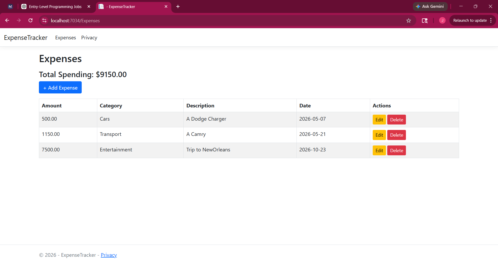
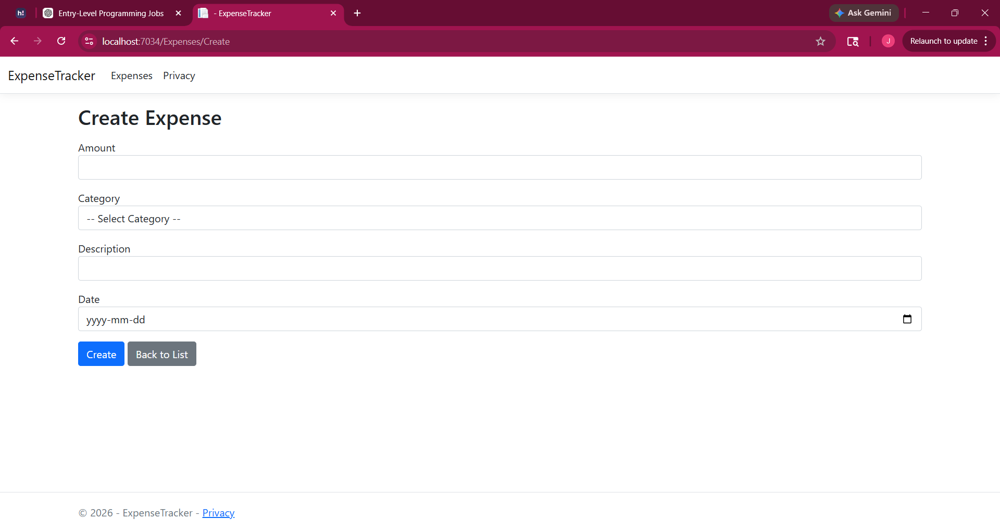
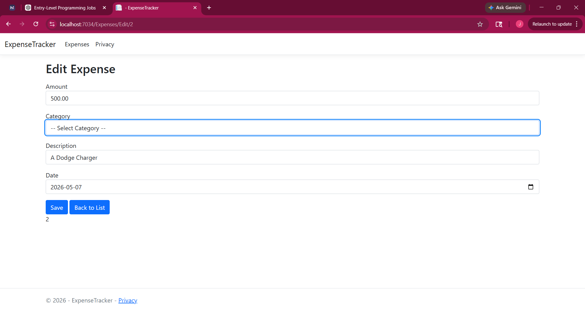
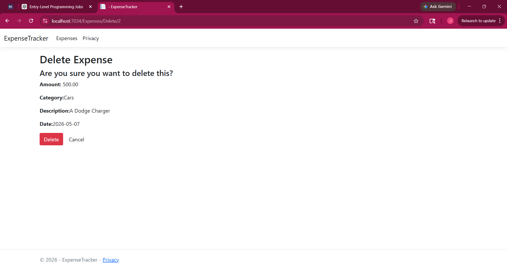

# Expense Tracker (ASP.NET Core MVC)

A full-stack web application built using ASP.NET Core MVC that allows users to track and manage their personal expenses.

---

## Features

* Add, edit, and delete expenses
* View all expenses in a clean table
* Calculate total spending automatically
* Filter expenses by category
* Form validation for better user experience
* Clean and responsive UI using Bootstrap

---

## Tech Stack

* C#
* ASP.NET Core MVC
* Entity Framework Core
* SQL Server
* HTML/CSS (Bootstrap)

---

## What I Learned

* Built a full CRUD application from scratch
* Connected ASP.NET Core to SQL Server using EF Core
* Used MVC architecture (Models, Views, Controllers)
* Implemented data validation and filtering
* Improved UI/UX with Bootstrap

---

## How to Run

1. Clone the repository
2. Open in Visual Studio
3. Run `Update-Database` in Package Manager Console
4. Press F5 to start the app

---

## Future Improvements

* Add authentication (user accounts)
* Monthly expense summaries
* Charts and analytics dashboard

## Screenshots

### Expense List

### Add Expense

### Edit Expense

### Delete Expense

